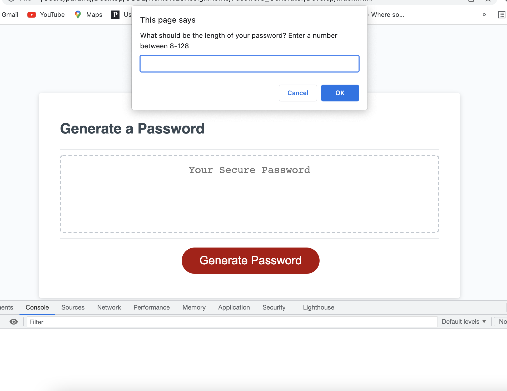
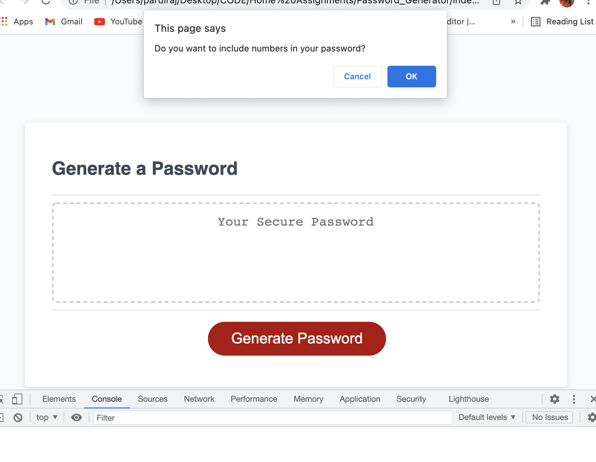
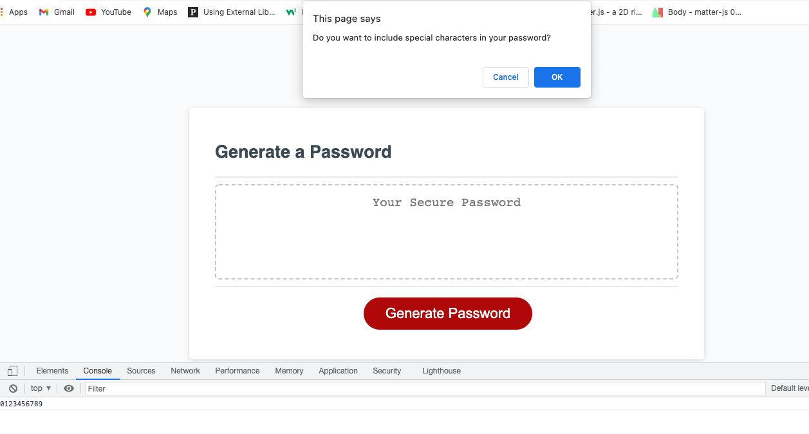
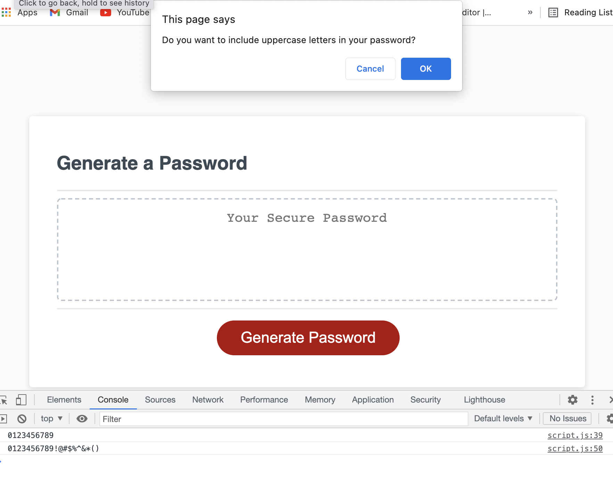
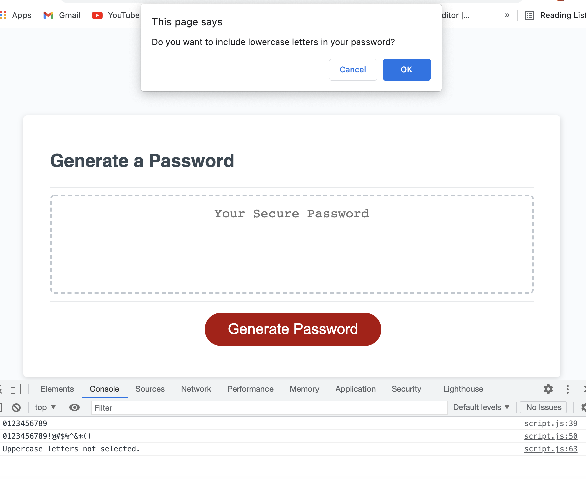
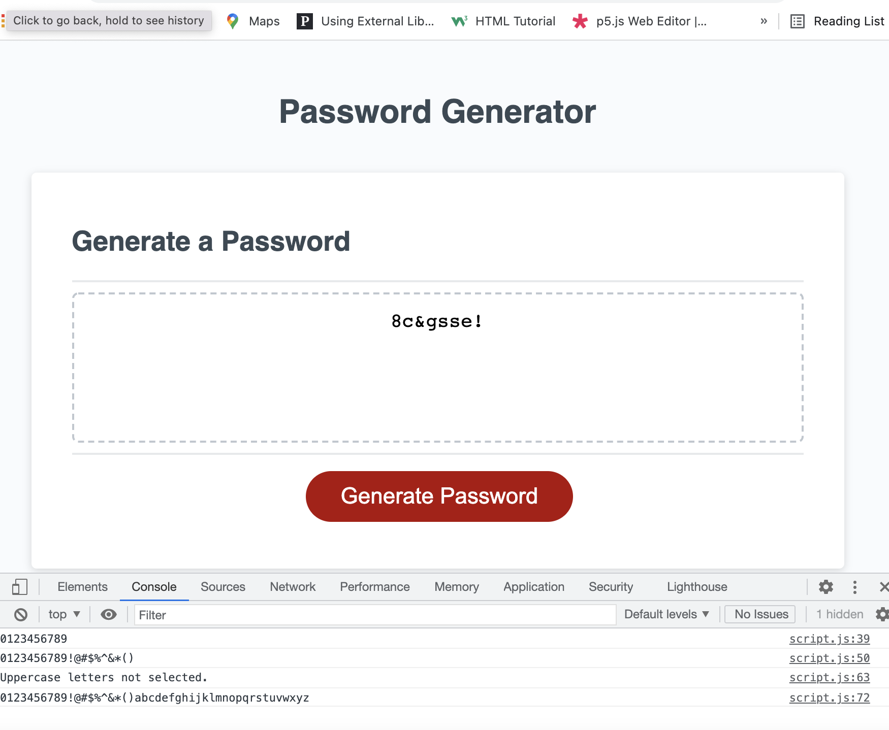

# Password Generator

## Description
A random password generator is a software program, that takes input from the user and based on those input criteria automatically generates a password. 

## Why do we need a Password Generator?
* The primary objective of using a generator is creation of strong and unpredictable passwords for all of your accounts.

## Problems Solved
This random password generator prompts the user for the following criteria:

* The password length should be in between 8 to 128 characters. 
* Do you want to include numbers in your password? 
* Do you want to include special characters in your password?
* Do you want to include uppercase letters in your password?
* Do you want to include lowercase letters in your password?
* Once the program has verified that the password length meets the minimum and maximum requirements, it then determines which criteria the user has selected and generates a secure password string based on the user's input. 
* The new password is then displayed in the #password textarea.

## Tools & Technologies used
1. Visual Studio Code
2. GitHub
3. JavaScript
4. HTML
5. CSS
6. Git

## Links
* Github source code: https://github.com/sinka27/Password_Generator
* Github deployed page: https://sinka27.github.io/Password_Generator/

## Screenshots
* Asking user for the length of the password

* Asking user if they want to include numbers in their password

* Asking user if  they want to include special characters in their password
(In the console it shows that char string is updated with numbers if user has selected numbers) 

* Asking user if  they want to include uppercase letters in their password
(In the console it shows that char string is updated with numbers & special characters if user has selected numbers) 

* Asking user if  they want to include lowercase letters in their password
(In the console it shows that char string is updated with numbers & special characters and displays message that uppercase letters not selected since user did not select them) 

* When all criteria have been selected the password is displayed in #password textarea.
(In the console it shows that char string is updated with numbers, special characters and lowercase letters) 

## Credits
1. Parul Raj
2. Joe Rehfuss
3. Brett Belka
4. Louis Coleman